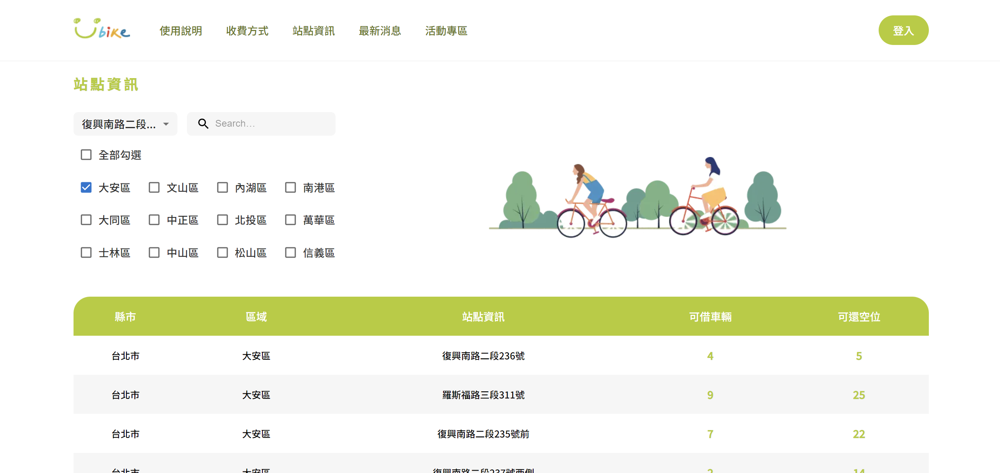

# 作者個人資訊

- **姓名：** 林柏諺
- **學歷：** 陽明大學生物醫學工程學系碩士班
- **出生日期：** 1992/02/18
- **連絡電話：** 0935255616
- **電子郵件：** miraculous0218@hotmail.com
- **GitHub：** [ishitoralin](https://github.com/ishitoralin)

# 專業技能

## 前端技能：

- HTML/CSS

  - 可使用原生語法刻出 Figma 所呈現之樣式。
  - 熟悉 Bootstrap、Material UI 等套件使用，加速開發進程。
  - 熟悉排版及 RWD 相關技巧(包含 grid、flex、position、z-index)。
  - 了解 Saas 使用加速專案開發

- Javascript ES5/ES6 語法

  - 熟悉使用 JS 原生語法串接 API
  - 熟悉 JSON 資料處理

- React(Next.js)
  - 熟悉 React 狀態管理、可重複使用元件開發
  - 熟悉網頁前後端分離及資料傳遞
  - 熟悉 API 串接(包含 Fetch API、Axios、AJAX)
  - 了解 Typescript 開發基本概念

## 後端技能：

- Node.js(Express)

  - 熟悉資料庫串接(MySQL、MAMP，了解 MongoDB 基本概念)
  - 熟悉由前端送來資料型態處理
  - 熟悉 middleware 建立及使用

- PHP
  - 了解基本語法
  - 了解使用 PHP 開發網頁

## 開發經驗：

### 網站 LOGO：

畫面及RWD效果請參考
https://docs.google.com/document/d/1FsVbCKiITJKM9i2pbdNGzK4_SHCU4NF5nDmyrBKO2tg/edit?usp=drive_link

#### 基本介紹：
- 建立健身房網站，並結合電商功能，販賣課程及實體產品(食品、器材、衣服)
- React(Next.js)開發前端視覺及切版RWD
- Node.js(Express)開發後端資料處理及前端資料接收
- MySQL(MAMP)資料庫，進行資料儲存

#### 負責區塊：
- 商品、課程加入購物車 API
- 購物車結帳流程前後端 API 開設與串接
- 藍新金流串接
- 寄送訂單明細 API
- 購物車所有頁面 RWD 設計

### 個人專案：

#### 基本介紹：
- 基本頁面形象呈現
- 串接台北市政府ubike及時站點API

# 經歷

- **2023~2023** 進修 資展國際前端工程師養成班
- **2020~2022** 就職 衛生福利部食品藥物管理署
- **2019~2020** 留學 日本北海道札幌 JaLS
- **2017~2019** 就職 長庚光電所楊家銘老師實驗室
- **2014~2016** 碩士 陽明大學 生物醫學工程學系
- **2010~2014** 大學 中國醫藥大學 生物科技學系
